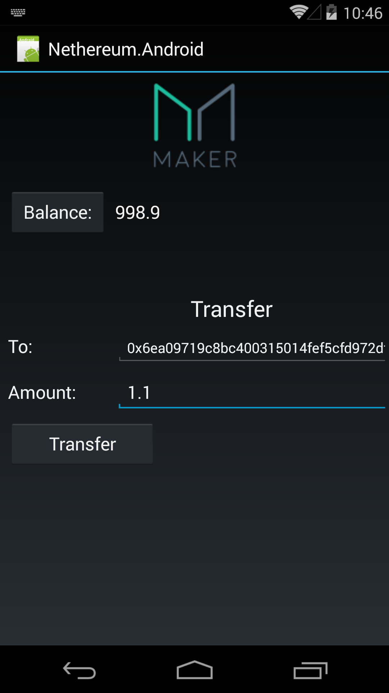

# Nethereum.Android.MakerSample

Quick example of using Nethereum in an Android Client using the ERC20 standard token of Maker using the Portable class library.

This is built using Xamarin, which is now free after Microsofts Merger. Get it here https://www.xamarin.com/download

The example validates the portable library of Nethereum, for connectivity, contract encoding and decoding, and normal interactivity using geth (unlock account).

* Connects to a geth client
* Retrieves the balance (Morden as an example) from a Maker contract using the given address. 
* Transfer amount, unlocking account first.

